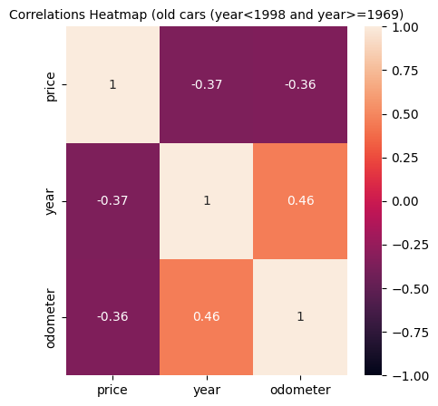

# What drives the price of a car?

## OVERVIEW

In this application, I will explore a dataset maintained in Kaggle.The original dataset contained information on 3 million used cars. The provided dataset contains information on 426K cars to ensure speed of processing.  My goal is to understand what factors make a car more or less expensive.  As a result of my analysis, I should provide clear recommendations to my client -- a used car dealership -- as to what consumers value in a used car.

[Notebook link](prompt_II.ipynb)

## CRISP-DM Framework

CRISP-DM stands for the Cross Industry Standard Process for Data Mining. It is a widely used and well-established methodology for guiding data mining and analytics projects. The CRISP-DM process model provides a structured approach to planning, executing, and evaluating data mining projects. It consists of six major phases:

Business Understanding:
- Define the business problem.
- Establish the project objectives.
- Assess the situation to understand the requirements and constraints.
  
Data Understanding:
- Collect and explore the initial data.
- Identify data quality issues.
- Evaluate the data's suitability for analysis.
- Initial transformations of variables as needed for analysis.
  
Data Preparation:
- Clean and preprocess the data.
- Handle missing values and outliers.
- Transform variables as needed for analysis.
  
Modeling:
- Select and apply appropriate modeling techniques.
- Calibrate and optimize model parameters.

Evaluation:
- Evaluate and validate the model's performance.
- Validate the model's robustness and generalizability.
- Assess the model's effectiveness against business objectives.

Deployment:
- Report the analysis to the client

The CRISP-DM methodology is iterative, meaning that it often involves cycling back through the phases as needed. This flexibility allows data scientists and analysts to refine their approach based on insights gained during the process. The methodology is widely used in various industries for data mining, machine learning, and analytics projects to ensure a systematic and well-organized workflow.

## Business Understanding

### 1.1 Determining Business Objectives
**Objective:**
The primary objective of this project is to conduct a comprehensive analysis of the used car market in the USA. The insights derived from this analysis will empower our client, a group of used car dealerships, to understand the factors influencing the pricing of used cars. By **identifying the key features that drive the pricing of used cars**, our goal is to provide clear and actionable recommendations for our client to enhance their business strategies.

**Background:**
The used car market is dynamic and influenced by various factors, ranging from the vehicle's make and model to its mileage, age, and overall condition. Understanding the nuances of these factors is crucial for our client's success in pricing their inventory competitively. As non-technical individuals, our client relies on our expertise to translate complex data into practical insights that can inform their business decisions.

**Stakeholders:**
Our primary stakeholders are the used car dealerships comprising our client group. Their perspective and understanding of consumer preferences are central to the success of this analysis. It is imperative to bridge the gap between technical insights and practical applications, ensuring that our findings resonate with the goals and challenges faced by our non-technical audience.

### 1.2 Assesing the situation:

The global market for used cars was valued at USD 1.66 trillion in 2022 and is projected to experience a compound annual growth rate (CAGR) of 6.1% between 2023 and 2030. In 2021 only, the total volume of used car shipments was 120.3 million units. The used car industry has witnessed remarkable progress over recent years due to increased competitiveness among new players in terms of pricing. The rise in sales volume of used cars can be attributed to customers' inability to purchase new cars and investments by market participants to establish their dealership networks. These networks helped to brand and promote viable used car options in the market.

**Risks and Contingencies**
We concluded the following risks:
- The available data used for the analysis cover the period from 1900 to 2022. Throughout these years, we should create market segmentations.
- There are around 400k observations, which are not the most indicative sample of our market. In other words, there is a probability of creating biased models that catch a specific market trend in a particular period. 
- It is worth mentioning that most of the data falls between the years 1998 and 2021. 
- We are restricted to using only regression models such as Lasso, Ridge, ElasticNet, Linear regression, etc. These models are generally categorised as linear-type models. They may only generalise well if the model's features strongly correlate with the variable we want to predict.
- We should not use the car's VIN code in our models as it will give rise to possible data privacy and ethical issues.

We should inform our client of the above risks and provide a plan for how to tackle them. More specifically, in a future engagement with the client, we should train our models with more recent data that is representative of our local market. The above could be achieved by creating a competitive data strategy before conducting ML solutions.

### 1.3 Determining the data mining goals

Translating the client's business objectives into data mining terms:
- The problem we are asked to solve is a supervised regression task.
- In other words, using a flat type dataset that contains the cars' characteristics as features, we should predict the sale price of used cars. 
- Furthermore, the models that we could use are Linear, Polynomial, Lasso, Ridge and Elastic Net regression models.
- We should choose the best performing models before conducting a regression analysis (interpreting the models).
- The models will be scored based on their R-squared score. In addition, we will consider the MSE and RMSE score and lastly the Adjusted R-squared score.
- In general, we should understand how the input features contribute to the prediction of the target variable (price). In addition, the most significant factors of the models should be addressed. In this way we will provide accurate recommendations to our client.

## Data Understanding and Preparation

The dataset was cleaned and the features were transformed accordingly. The initial dataset's perimeter was 426880 observations with 18 variables. The final dataset's perimeter was 66969 observations with 16 variables.

**Furthermore, from the data understanding phase we concluded the following point:**
- I removed the target variable's outliers, duplicates, nulls and non-significant features such as VIN. 
- Although I did not drop the region, state, model and paint_color variables, they did not used in the data preparation and modelling phase.
- I kept the data between the years 1908 and 2021.
- The dataset was split into three segments with different behaviours for the price trend per year. The **first** was the **newer generation cars** (year >= 1998), where the newer cars have higher prices. The **second** was the **old cars** (year >= 1969 and year < 1998), where the newer cars have lower prices. The **third** was the **antiques** (year < 1969), where price vs year has no distinctive trend.
- The **odometer** variable is **correlated / anti-correlated** with the variable **year**. 
- For **old and new-generation cars**, I **only kept either the year or the odometer** in my modelling phase. In this way, I mitigated the risk of multicollinearity.
- For antiques, I **only used the odometer**.
- I  **log-transformed** the **target variable (price)**.
- The variable/ feature **manufacturer_cluster** was created based on the median price per manufacturer. Three clusters/levels were created and possibly were used to reduce modelling complexity. Also, I considered **involving** the initial **manufacturer** variable as it was **more valuable**.
- I kept the **condition** variable **only for old cars and antiques**.
- I kept the **type** variable **only for old and new generation cars**.
- I kept the **drive** variable **only for old and new generation cars**.
- **Fuel** and **cylinders** were used experimentally in the modelling phase. I **did not include fuel** in the **antiques**' modelling.

**In the data preparation phase:**
- I dropped the columns region, model, paint_color, state as I did not use them in my modelling phase.
- I created a column transformer function which I used on the modelling phase.
- Also, I created three variations of TransformedTargetRegressors (Ridge, Lasso, ElasticNet). All the variations log-transform my target variable (price)

## Modelling and Evaluation

**In the modelling phase:**

- I applied Holdout Cross-Validation. (test size = 10% )
- I created Lasso and Ridge regression models by applying the Grid Search Algorithm. The scoring method that was used for choosing the best estimator was the R-squared score

**More specifically below are the created models for each group**

New-generation cars group:
- Lasso_n
- Lasso_poly_n
- Ridge_n
- Ridge_poly_n

Old-cars group:
- Lasso_o
- Lasso_poly_o
- Ridge_o
- Ridge_poly_o

Antiques group:
- Lasso_a
- Lasso_poly_a
- Ridge_a
- Ridge_poly_a

**In the Evaluation phase, I calculated the R-squared score, the MSE and the RMSE of the models I created above. I chose the best models based on their R2 score** 

**More specifically:**

- **R-squared** (coefficient of determination) is a statistical measure in a regression model that determines the proportion of variance in the dependent variable that can be explained by the independent variable. In other words, r-squared shows how well the data fit the regression model (the goodness of fit)
- The mean squared error (**MSE**) of an estimator measures the average of the squares of the errors—that is, the average squared difference between the estimated values and the actual value.
- The root-mean-square error (**RMSE**) is the quadratic mean of the differences between the observed values and predicted ones.

Later in the deployment phase, I  calculated the **Adjusted R-squared Score**. More specifically, adjusted R-squared is calculated by dividing the residual mean square error by the total mean square error (which is the sample variance of the target variable). The result is then subtracted from 1. Adjusted R-squared is always less than or equal to R-squared. Lastly, Adjusted R-squared might decrease if a specific effect does not improve the model.

After some hyperparameters research and extra fine-tuning, the best models per group (new-generation cars, old cars, antiques) were chosen based on their R-squared, MSE and RMSE scores in the evaluation phase.

The models that will inform the client are:
- **Ridge_poly_n** for the new-generation cars.
- **Ridge_poly_o_v3** for the old cars.
- **Ridge_poly_a_v2** for the antiques

**Models score metrics:**

Ridge_poly_n:
- Train RMSE: 6380.47
- Test RMSE: 6199.89
- Train Adjusted R2: 0.708
- Test Adjusted R2: 0.712

Ridge_poly_o_v3:
- Train RMSE: 6891.76
- Test RMSE: 6676.69
- Train Adjusted R2: 0.426
- Test Adjusted R2: 0.393

Ridge_poly_a_v2:
- Train RMSE: 13334.25
- Test RMSE: 11890.66
- Train Adjusted R2: 0.315
- Test Adjusted R2: 0.316

## Insights to report:

- For **new-generation cars**, the most crucial feature of the model is the **year**. Furthermore, **cylinders** and **type** features drive the sale price of a used car but not as much as the year variable. By noticing the model's coefficients, it is evident that a small number of cylinders (3 to 5) are slightly dropping the sale price. When the cylinders are eight and above, the price grows somewhat. Lastly, the price is not significantly affected when a car has a 6-cylinder engine. By the same logic, the price of a car slightly decreases when it belongs to manufacturer clusters 1 and 2. On the other hand, the price is slightly increasing when the car belongs to the manufacturer cluster 3. Off-road and convertibles are generally sold at a higher prices than minivans. Lastly, it seems that the market calls for vehicles with diesel fuel. For example, cars with diesel as a fuel have higher sale prices than electric vehicles.

- The most crucial variable that drives the **old cars**' sale price is the **condition** of the car followed by its construction **year**, the number of **cylinders**, the **manufacturer**, the **type** and the **drive** type of the car. According to old cars' model coefficients, a fair condition reduces the sale price of a car, while an excellent condition somewhat increases the price. An 8, 10 or 12-cylinder engine positively contributes to the car's sale price, while engines with 6-cylinders and below tend to decrease the final sale price of a used car. In addition, if a car is a Porsche, Ferrari, Land Rover, or Aston Martin, the price is relatively high. Also, Volkswagen, Alfa-Romeo, Datsun, Toyota and Mitsubishi used cars are in demand as these brand names contribute positively to the sale price. Interestingly, cars made by Audi, BMW, Jaguar and Volvo do not significantly contribute to the final sale price. What is more, cars by US brands and Mercedes-Benz lose their value as the years pass. Also,  convertibles and bus-type cars are more expensive than other vehicle types. Lastly, the 4WD cars drive the price up while other drive types are negatively contributing to the sale price.

- The most crucial variable that drives the **antiques**' sale price is the **condition** of the car followed by the number of **cylinders**, the **manufacturer** and the **odometer** value of the car. For a fair condition, the price is reduced, while for a new and like-new condition, the price is higher. In addition, luxury and premium European brands like Porsche, Mercedes-Benz, Jaguar and Ferrari positively contribute to the price of a car. It is also interesting that if a vehicle is a Toyota, the price is generally higher than that of a Volvo or Volkswagen. Moreover, the cars made by US brands tend to lose their value as their prices are usually lower than those of European (or Asian) brands. Furthermore, engines with more cylinders (8 and above) make the car pricier. Cars with 4 or 6 cylinders tend to have lower prices.

## Recommendations:

- The client should focus primarily on luxury and premium European brands as they tend to keep or increase their value through time.
- The client should focus on the number of cylinders, which is also crucial. Cars with eight or more cylinders tend to have higher sale prices.
- The client should focus on offroad and convertible cars as they tend to keep (or increase) their value through the years.
- Depending on the group (new-generation cars and old cars), the client should focus on the manufacturing year of the vehicle. For new-generation cars, the higher the year, the higher the sale price. The opposite trend is noticed in the old-cars group.
- Condition plays a crucial role, especially on old cars and antiques. The client should focus on like-new cars and avoid cars with a condition labelled as fair.

## Next Steps:
- In a next client engagement, we should inform more accurately our client by creating more complex and non-linear models for the old-cars and antiques groups. 
- In addition, we should acquire more accurate and recent data on the subject for future projects.
- Lastly, we should better model the data and insert the features that were not involved in the modelling phase in future analysis.
